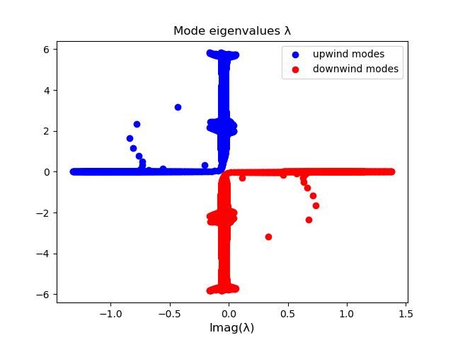
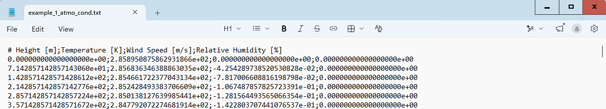
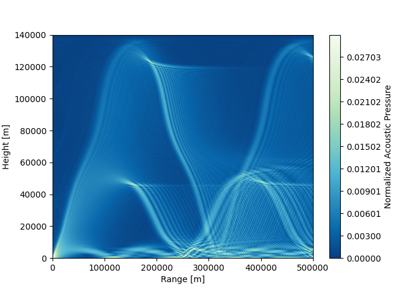
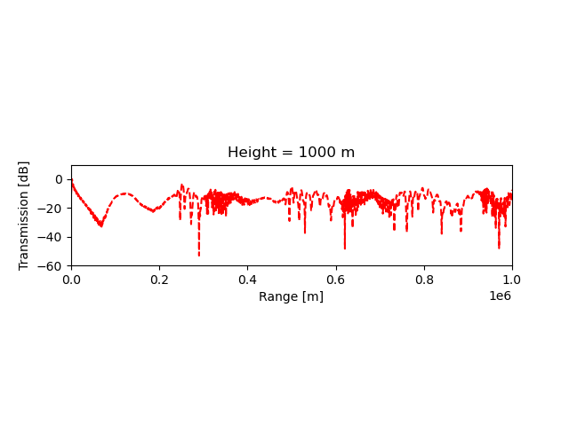

Example 1 - Infrasound propagation in a large-scale atmosphere
==============================================================

The large-scale, low-frequency sound propagation problem in https://doi.org/10.1121/10.0003567 (Figure 11),
and https://doi.org/10.1016/j.enganabound.2025.106308 (Figure 4) is
solved with the package. The problem is of particular interest because of the complex atmospheric conditions and the
resulting atmospheric waveguides that are formed at low-, medium- and high-altitudes.

This example follows the workflow depicted in Schematic 1 in (inserir link) and
the results are detailed in Section 3.1 of the same article.

Computing the Vertical Atmospheric (VA) Modes
---------------------------------------------

A Safe computation must be initiated.

.. code-block:: python

    from safe_vamd.safe_computation import SAFEComputation
    safe_comp = SAFEComputation()

The setup of the computation can be run with:

.. code-block:: python

    input_file = 'example_1_atmo_cond.txt'
    safe_comp.setup(input_file, 0.5, rho_at_ground=1.23, g_value=0, pml_thick_factor=2)

, where the excitation frequency has been set to 0.5 :math:`Hz`. The parameters *rho_at_ground* and *g_value* are the
the air density at ground level and the acceleration due to gravity, respectively, and were set to to 1.23
:math:`kgm^{-3}` and 0 :math:`ms^{-2}`.
The thickness of the Perfectly Matched Layer (PML) has been set to two times the greatest wavelength (*pml_thickness_factor=2*).
The parameter *input_file* is a path to a *.txt* file with the background atmospheric conditions,
given in the example folder under the name
"example_1_atmo_cond.txt". It has the following format:

.. image:: figures/example_1_atmo_cond.png

After setting up, the Vertical Atmospheric (VA) modes can be computed with:

.. code-block:: python

    acoustic_field = safe_comp.solve(alpha_value=0.4, air_absorption=False)

, where the parameter *alpha_value* is a term for added absorption in the Perfectly Matched Layer that was set to 0.4
:math:`dB/wavelength`. In this example, air absorption is not accounted for.

After the modes have been computed, a figure with the mode eigenvalues plotted in the complex-plane will show up.
The user can double check if the modes have been correctly separated into the downwind and upwind mode basis.

The VA modes can, finally, be exported into *.txt* files with:

.. code-block:: python

    safe_comp.save_modes_in_txt()

Matching the VA modes to the acoustic pressure samples.
-------------------------------------------------------

Vertical Atmospheric Mode Decomposition can be applied with the methods in the *VAMD* class:

.. code-block:: python

    from safe_vamd.vamd import VAMD
    vamd = VAMD()

After the VA modes have been computed and stored in *.txt* files, they can be loaded:

.. code-block:: python

    downwind_path = "downwind_modes.txt"
    upwind_path = "upwind_modes.txt"
    vamd.load_modes_from_txt(downwind_path=down_path, upwind_path=up_path)

and, then, filtered by resorting to the methods in the *mode_filter* attribute:

.. code-block:: python

    n_desired_modes = 320  # (or 380)
    vamd.mode_filter.sort_by_imag_part(side="downwind")  # sorting from less to more decaying
    vamd.mode_filter.filter_by_energy([0, 140 * 1000], 0.95, side="downwind")  # removing PML modes
    vamd.acoustic_field.downwind_modes = vamd.acoustic_field.downwind_modes[0:n_desired_modes]  # truncating mode basis

To ensure the correct filtering of the modes, their eigenvalues can be plotted before and after filtering
has been applied:

.. code-block:: python

    vamd.mode_filter.plot_eigenvalues(upwind_color='grey', downwind_color='black'
    ### any mode fitlering here ###
    vamd.mode_filter.plot_eigenvalues(upwind_color='grey', downwind_color='red',
                                  downwind_label='downwind modes (filtered)', mk=True)

, which for this example would generate the following image:

.. image:: figures/example_1_eigenvalues.png

The samples can be loaded with:

.. code-block:: python

    vamd.load_samples_from_txt("./samples/samples_x=7p5km+10km.txt")

, where *"./samples/samples_x=7p5km+10km.txt"* is a path to a *.txt* file in the example folder with
the acoustic pressure samples. It has the following format:

The VA modes can be matched to the samples with:

.. code-block:: python

    acoustic_field = vamd.match_modes_to_samples(spread_3d=False)

For this example, spherical spreading has not been taken into account in the mode decomposition (*spread_3d=False*).

After the VA modes have been matched to the samples, the example script also includes some post-processing and plotting.
The generated contour plot for the normalized acoustic pressure is presented here:

, along with the transmission (in :math:`dB`) along a horizontal line 1 km from the ground:

,where the black line is the original field , computed with the Linearized Euler Equations (LEE),
and the red dashed line represents the field reconstructed via mode decomposition.