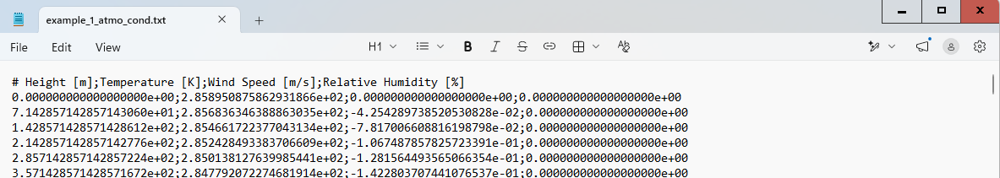
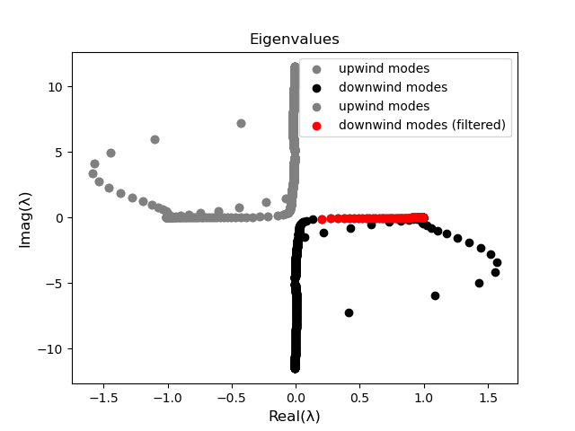

Example 1
==========
Short description about the problem and link it with the article and the schematic?

Computing the Vertical Atmospheric (VA) Modes
---------------------------------------------

A Safe computation must be initiated.

.. code-block:: python

    from safe_vamd.safe_computation import SAFEComputation
    safe_comp = SAFEComputation()

The estup step can be run with:

.. code-block:: python

    input_file = "example_1_atmo_cond.txt"
    safe_comp.setup(input_file, 180, rho_at_ground=1.235, g_value=9.81, pml_thick_factor=2)

The .txt file with the background atmospheric conditions is given in the example folder under the name "example_1_atmo_cond.txt"
and has the following format:

The VA modes can be solve with:

.. code-block:: python

    acoustic_field = safe_comp.solve(alpha_value=0.4, air_absorption=False)

, and then exported into .txt files with:

.. code-block:: python

    safe_comp.save_modes_in_txt()

An image with the computed eigenvalues in the real-complex plane will show up.

Matching the VA modes to the acosutic pressure samples.
-------------------------------------------------------

Meter fotos dos ficheros txt e assim.

.. code-block:: python

    from safe_vamd.vamd import VAMD
    vamd = VAMD()

The modes can then be loaded:

.. code-block:: python

    downwind_path = "downwind_modes.txt"
    upwind_path = "upwind_modes.txt"
    vamd.load_modes_from_txt(downwind_path=down_path, upwind_path=up_path)

and then filtered:

.. code-block:: python

    n_desired_modes = 320  # (or 380)
    vamd.mode_filter.sort_by_imag_part(side="downwind")  # sorting from less to more decaying
    vamd.mode_filter.filter_by_energy([0, 140 * 1000], 0.95, side="downwind")  # removing PML modes
    vamd.acoustic_field.downwind_modes = vamd.acoustic_field.downwind_modes[0:n_desired_modes]  # truncating mode basis

the mode eigenvalues can be plotted before the mode filtering:

.. code-block:: python

    vamd.mode_filter.plot_eigenvalues(upwind_color='grey', downwind_color='black'
    ### any mode fitlering here ###
    vamd.mode_filter.plot_eigenvalues(upwind_color='grey', downwind_color='red',
                                  downwind_label='downwind modes (filtered)', mk=True)

, which for this example would generate the following image:

The samples can be loaded with:

.. code-block:: python

    vamd.load_samples_from_txt("./samples/samples_x=7p5km+10km.txt")

the .txt files with the acoustic pressure samples has the following format:

the samples can me matched to the samples with:

.. code-block:: python

    acoustic_field = vamd.match_modes_to_samples(spread_3d=False)