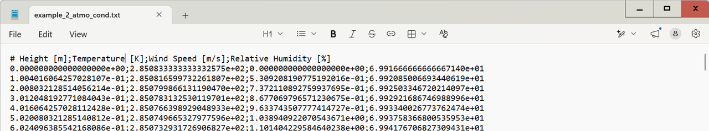
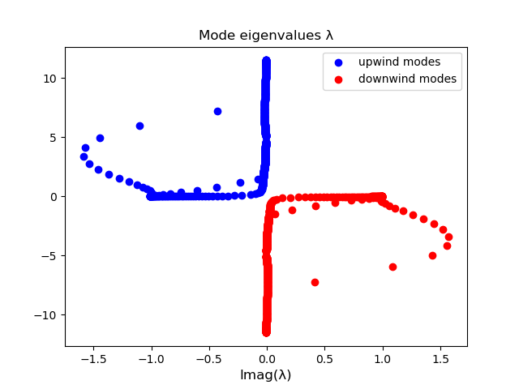
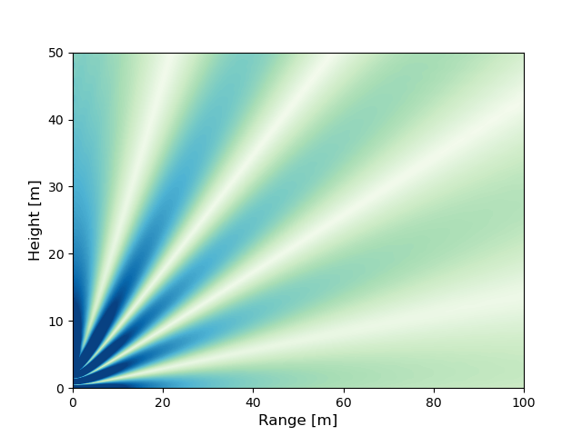
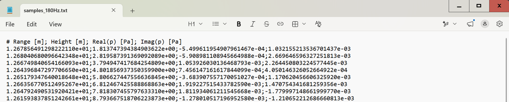
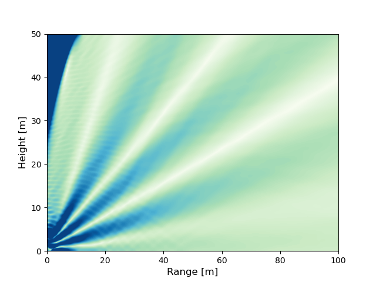
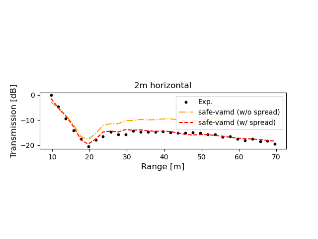

Example 2 - Experimental outdoor reconstruction
===============================================
The work in http://dx.doi.org/10.2139/ssrn.7427778 employed the VAMD method to reconstruct the acoustic far-field induced by an outdoor source
from experiments.

This example follows the workflow depicted in Schematic 1 in (inserir link) and
the results are detailed in Section 3.2 of the same article.

Computing the Vertical Atmospheric (VA) Modes
---------------------------------------------

A Safe computation must be initiated.

.. code-block:: python

    from safe_vamd.safe_computation import SAFEComputation
    safe_comp = SAFEComputation()

The setup of the computation can be run with:

.. code-block:: python

    input_file = "example_2_atmo_cond.txt"
    safe_comp.setup(input_file, 180, rho_at_ground=1.235, g_value=9.81, pml_thick_factor=2)

The *.txt* file with the background atmospheric conditions is given in the example folder under the name "example_2_atmo_cond.txt".
It has the following format:

After setting up, the VA modes can be computed with:

.. code-block:: python

    sigma_e = 841680
    z_180hz = 0.218 * ((sigma_e / 180) ** (1 / 2)) * (1 + 1j)
    acoustic_field = safe_comp.solve(ground_impedance_value=z_180hz, alpha_value=0.2, air_absorption=True)

, where the parameter *alpha_value* is a term for added absorption in the Perfectly Matched Layer.
In this example, air absorption is accounted for and a ground impedance for grass, computed with Eq. 14 in (inserir link) and Ref, is assigned.

After the modes have been computed, a figure with the mode eignevalues plotted in the complex-plane will show up.
The user can double check if the modes have been correctly separated into downwind and upwind.

The VA modes can be exported into *.txt* files without prior weighing:

.. code-block:: python

    safe_comp.save_modes_in_txt()

, or they can be matched to a monopole at the origin, 3.6 m from the ground and an amplitude of 1 :math:`kgm^3 s^{-1}))`:

.. code-block:: python

    safe_comp.match_to_monopole(source_height=3.6, source_amplitude=1, side='downwind')

The monopole matched field can be computed and plotted with:

.. code-block:: python

    rangos = np.linspace(0, 100, 1001)
    x, z, p = acoustic_field.get_plot_data(rangos, side='downwind') # using the acoustic_field object

    plot_limit = 0.1
    ps = np.array(abs(p)/np.max(abs(p)))  # Normalizing the acoustic pressure w.r.t the maximum amplitude
    ps = np.where(ps < plot_limit, ps, plot_limit)
    levels = np.linspace(0.0, plot_limit, 100)
    plt.contourf(x, z, ps, cmap='GnBu', levels=levels)
    plt.xlim([0, 100])
    plt.ylim([0, 50])
    plt.xlabel('Range [m]', fontsize=12)
    plt.ylabel('Height [m]', fontsize=12)
    plt.show()

, resulting in the following figure:

Matching the VA modes to the acoustic pressure samples.
-------------------------------------------------------

Vertical Atmospheric Mode Decomposition can be applied with the methods in the *VAMD* class:

.. code-block:: python

    from safe_vamd.vamd import VAMD
    vamd = VAMD()

 After the VA modes have been computed and stored in *.txt* files, they can be loaded:

.. code-block:: python

    downwind_path = "downwind_modes.txt"
    upwind_path = "upwind_modes.txt"
    vamd.load_modes_from_txt(downwind_path=down_path, upwind_path=up_path)

and then filtered by resorting to the methods in the *mode_filter* attribute:

.. code-block:: python

    n_modes = 52
    vamd.mode_filter.sort_by_imag_part(side='downwind')  # Sorting from less decaying to more decaying
    vamd.mode_filter.filter_by_energy([0, 50], 0.85, side='downwind')  # removing PML modes
    vamd.acoustic_field.downwind_modes = vamd.acoustic_field.downwind_modes[0:n_modes] # truncating mode basis

To ensure the correct filtering of the modes, their eigenvalues can be plotted before and after filtering has been applied:

.. code-block:: python

    vamd.mode_filter.plot_eigenvalues(upwind_color='grey', downwind_color='black'
    ### any mode fitlering here ###
    vamd.mode_filter.plot_eigenvalues(upwind_color='grey', downwind_color='red',
                                  downwind_label='downwind modes (filtered)', mk=True)

, which for this example would generate the following image:

.. image:: figures/example_1_eigenvalues.png

The samples can be loaded with:

.. code-block:: python

    vamd.load_samples_from_txt("./samples/samples_180Hz.txt")

The *.txt* files with the acoustic pressure samples has the following format:

The samples can be matched to the samples with:

.. code-block:: python

    acoustic_field = vamd.match_modes_to_samples(spread_3d=False)

After the VA modes have been matched to the samples, the example script also includes some post-processing and plotting.
The generated contour plot for the normalized acoustic pressure is presented here:

, along with the transmission (in dB) for the horizontal line 2 m from the ground:

